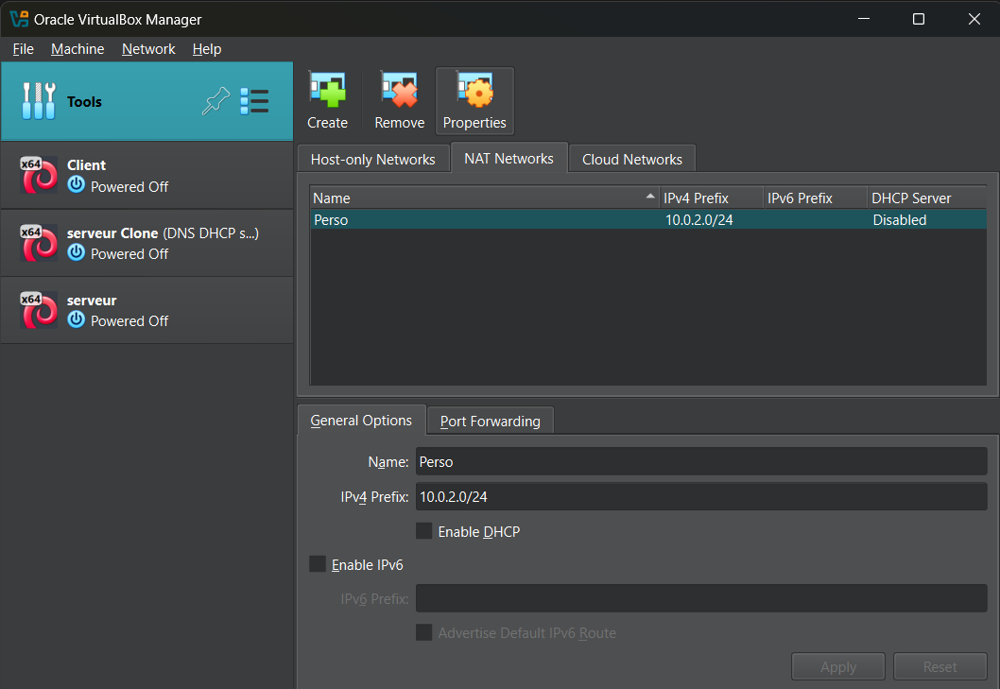

- Use of VirtualBox (Oracle)
- Make sure to add a NAT Network before starting the server setup and enable the NAT Network for your newly created VM:
	
	
- Image of Debian Server 12.7.0 available [here](https://www.debian.org/distrib/)
	- User: nox
	- Password: 1234
- Install sudo and get the root privileges for your user:
  1. `su root`
  2. `apt install sudo`
  3. `sudo visudo`
	- add your username under root and save the file
- Updating and upgrading the server using `sudo apt update` and `sudo apt upgrade`
- Preparing the setup by installing packets: 
	- `sudo apt install openssh-server`
	- `sudo apt install openssh-client`
	- `sudo apt install bind9 bind9-utils bind9-dnsutils -y`
  	- `sudo apt install nginx`

Got to [2. Installing Firewall](/Firewall.md)
