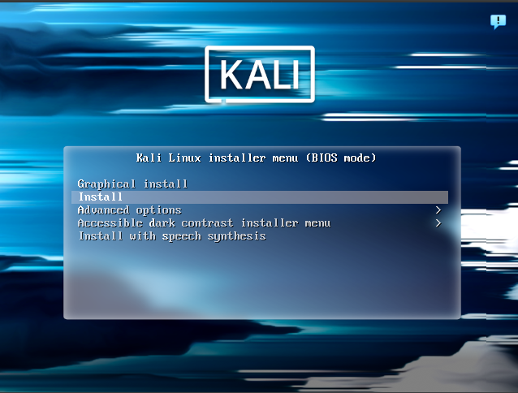

Nothing too fancy, we are using [Virtual Box](https://www.virtualbox.org/) and a Kali Linux [.iso](https://www.kali.org/get-kali/#kali-platforms).

The important thing to which we must pay attention prior to launching the VM is that it should be using the **NAT Network** adapter that we created for the server. The one using `10.0.2.0` static IP address.

Pay close attention to the setup window. You do not want to miss the step that allows you to partition your disk.

You will first need to select the `install` option when the following installer menu appears:

Then, it's a matter of following the instructions up until this point:

In order: `Manual` > `Guided partitioning` > `Guided - use entire disk` > `Separate /home partition` > `Finish partitioning and write changes to disk` > `Yes`.

The screenshots can be found [here](/images/disk).

Once the VM is ready and launched, do not forget to update and upgrade this bad boy:
- `sudo apt update`
- `sudo apt upgrade`

There are now a few packets that need to be installed:
- Openssh:`sudo apt install openssh-client`
- Gimp:`sudo apt install gimp`
- LibreOffice: `sudo apt install libreoffice`

Once that's done, we are ready to roll!

